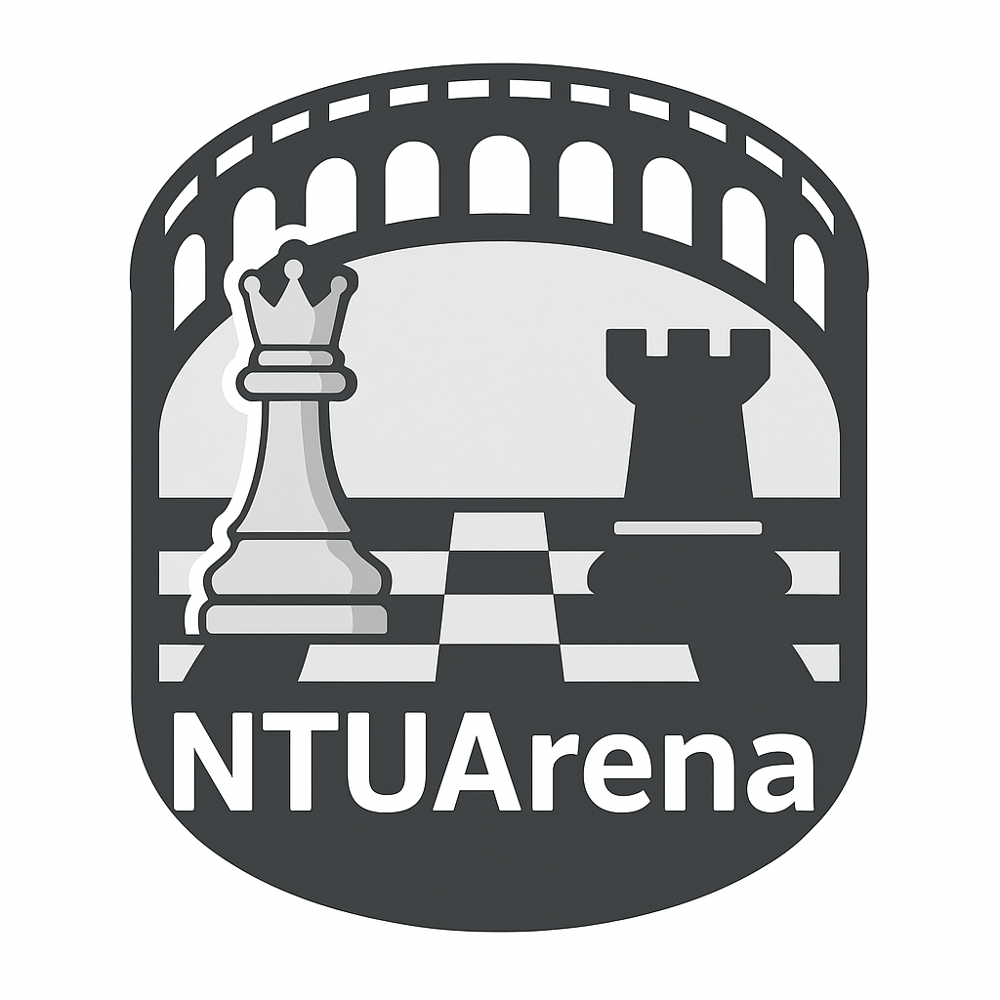

<p align="center">
  
</p>

<h1 align="center">NTUArena</h1>

<p align="center">
  <strong>Real-time OTB chess tournament management platform</strong><br>
  Swiss-system &amp; Arena-style tournaments with automated pairing, live standings, and Elo tracking
</p>

<p align="center">
  
  
  
  
</p>

---

## About

NTUArena is a web application built for **Skaki NTUA – Le Roi**, the chess club of the National Technical University of Athens. It manages over-the-board (OTB) chess tournaments with real-time game pairing, live standings, player statistics, and Elo rating tracking.

<p align="center">
  
  <br>
  <em>Powered by Skaki NTUA – Le Roi</em>
</p>

## Features

- **Tournament Management** — Create and manage Swiss-system and Arena-style tournaments
- **Automated Pairing** — Players are paired automatically based on Elo, performance, and Swiss rules
- **Live Standings** — Real-time leaderboard updates during tournaments
- **Elo Rating System** — Automatic Elo calculation and tracking across tournaments
- **Player Profiles** — Game history, statistics, and performance tracking
- **Role-Based Access** — Admin, player, and spectator roles with JWT authentication
- **CSV Import** — Bulk import players and users via CSV files
- **Responsive UI** — Works on desktop and mobile browsers

## Tech Stack

| Layer | Technology |
|-------|-----------|
| **Frontend** | React 18, React Router |
| **Backend** | Node.js, Express |
| **Database** | MongoDB |
| **Cache** | Redis |
| **Reverse Proxy** | Nginx |
| **Containerization** | Docker Compose |

## Architecture

```
┌─────────────┐     ┌─────────────┐     ┌─────────────┐
│   Browser    │────▶│    Nginx     │────▶│   React     │
│              │     │  (port 80)  │     │  Frontend   │
└─────────────┘     │             │     └─────────────┘
                    │  /api/ ───▶ │     ┌─────────────┐
                    │             │────▶│   Express    │
                    └─────────────┘     │   Backend   │
                                        │  (port 5000)│
                                        └──────┬──────┘
                                               │
                                    ┌──────────┴──────────┐
                                    │                     │
                              ┌─────┴─────┐         ┌────┴────┐
                              │  MongoDB  │         │  Redis  │
                              │ (replica) │         │ (cache) │
                              └───────────┘         └─────────┘
```

## Quick Start

### Prerequisites

- [Docker](https://docs.docker.com/get-docker/) and [Docker Compose](https://docs.docker.com/compose/install/)

### 1. Clone the repository

```bash
git clone https://github.com/YOUR_USERNAME/ArenaManager.git
cd ArenaManager
```

### 2. Configure environment

```bash
cp .env.example .env
```

Edit `.env` to set your own values (JWT secret, passwords, etc.). See [Environment Variables](#environment-variables) for details.

### 3. Start the application

```bash
docker compose up -d --build
```

### 4. Open in browser

```
http://localhost
```

## Environment Variables

| Variable | Description | Default |
|----------|-------------|---------|
| `APP_MODE` | `dev` or `prod` — selects Dockerfile and Nginx config | `dev` |
| `PORT` | Backend server port | `5000` |
| `NODE_ENV` | Node environment | `development` |
| `AUTH_ENABLED` | Enable JWT authentication | `true` |
| `JWT_SECRET` | Secret key for JWT tokens | *(change in production)* |
| `JWT_EXPIRES_IN` | Token expiration time | `7d` |
| `MONGO_DB` | MongoDB database name | `ntuarena` |
| `MONGO_URI` | MongoDB connection string | `mongodb://mongo:27017/ntuarena?replicaSet=rs0` |
| `REDIS_PASSWORD` | Redis password | *(change in production)* |
| `REDIS_URL` | Redis connection string | `redis://:password@redis:6379` |
| `CORS_ORIGIN` | Allowed CORS origin | `*` |

## Dev vs Prod Mode

Switch between development and production with a single env variable:

```bash
# .env
APP_MODE=dev    # React dev server (hot reload)
APP_MODE=prod   # Nginx serving static build
```

| | Dev | Prod |
|---|---|---|
| **Frontend Dockerfile** | `Dockerfile.dev` | `Dockerfile.prod` |
| **Nginx config** | `nginx.dev.conf` (→ port 3000) | `nginx.prod.conf` (→ port 80) |
| **Hot reload** | ✅ | ❌ |
| **Image size** | ~1 GB | ~25 MB |

After changing `APP_MODE`, rebuild:

```bash
docker compose up -d --build
```

## Project Structure

```
ArenaManager/
├── assets/                  # Logos and static assets
├── backend/
│   ├── src/
│   │   ├── controllers/     # Route handlers
│   │   ├── middleware/       # Auth, validation
│   │   ├── models/          # Mongoose schemas (User, Player, Tournament, Game)
│   │   ├── routes/          # Express route definitions
│   │   ├── services/        # Business logic (pairing, Elo, etc.)
│   │   ├── utils/           # Helpers
│   │   └── server.js        # Express app entry point
│   ├── Dockerfile
│   └── package.json
├── view/
│   ├── src/
│   │   ├── components/      # Reusable UI components
│   │   ├── contexts/        # React contexts (auth)
│   │   ├── pages/           # Page components
│   │   ├── services/        # API client
│   │   └── App.js           # Root component
│   ├── Dockerfile.dev       # Development (React dev server)
│   ├── Dockerfile.prod      # Production (multi-stage Nginx build)
│   └── package.json
├── nginx/
│   ├── nginx.dev.conf       # Dev: proxies to frontend:3000
│   └── nginx.prod.conf      # Prod: proxies to frontend:80
├── scripts/
│   └── backup-mongo.sh      # Database backup script
├── seed/                    # Database seed data
├── docs/                    # API docs and diagrams
├── docker-compose.yml
├── .env.example
└── .github/
    └── dependabot.yml       # Grouped dependency updates
```

## Database Backup

Run a manual backup:

```bash
./scripts/backup-mongo.sh
```

Schedule daily backups via cron:

```bash
# Every day at 3 AM
0 3 * * * /path/to/ArenaManager/scripts/backup-mongo.sh
```

Backups are stored in `backups/` with 7-day retention.

## Security

See [SECURITY.md](SECURITY.md) for our security policy and vulnerability reporting guidelines.

**Key security measures:**
- JWT authentication with bcrypt password hashing
- NoSQL injection prevention (`express-mongo-sanitize`)
- Rate limiting on all API endpoints
- CORS origin restriction
- All secrets in environment variables

## Contributing

1. Fork the repository
2. Create a feature branch (`git checkout -b feature/my-feature`)
3. Commit your changes (`git commit -m 'Add my feature'`)
4. Push to the branch (`git push origin feature/my-feature`)
5. Open a Pull Request

## License

This project is licensed under the [GNU General Public License v3.0](LICENSE).  
You are free to use, modify, and distribute this software under the terms of the GPL-3.0. Any derivative work must also be distributed under the same license.

---

<p align="center">
  Made with ♟️ by <strong>Skaki NTUA – Le Roi</strong>
</p>
